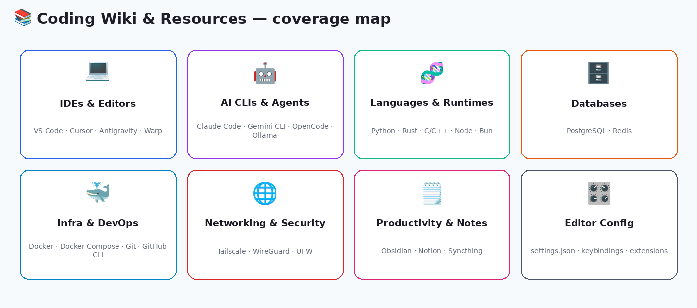

<p align="center">
  
</p>

<h1 align="center">📚 Coding Wiki & Resources</h1>

<p align="center">
  <b>A personal Obsidian vault documenting a full AI-assisted development environment — editor configs, install commands, and the CLI tools that make up the stack.</b>
</p>

<p align="center">
  
  
  
</p>

<p align="center">
  
</p>

## 🧩 What problem does it solve?

Setting up a new machine — or just remembering *which* flag installs Redis on Fedora, or what your VS Code color theme JSON looked like — burns time you'd rather spend building. This repo is a running reference so that knowledge doesn't live only in shell history or a half-remembered blog post: every install command, editor setting, and CLI tool in the current dev workflow is written down once, in one place, ready to copy-paste.

## 📂 What's actually in here right now

| File | What it covers |
|---|---|
| **[`Configurations For Developers.md`](./Configurations%20For%20Developers.md)** | IDE extension list, VS Code workspace `settings.json`, user `settings.json`, and `keybindings.json` — plus an Obsidian plugin checklist and a categorized list of must-have apps (backend CLIs, frontend IDEs, AI CLIs, productivity tools) |
| **[`Linux-developer-must-have-apps.md`](./Linux-developer-must-have-apps.md)** | A Fedora installation checklist — copy-paste `dnf`/`curl`/`flatpak` commands for ~60 tools, from language runtimes and AI coding agents to databases, browsers, and media utilities |
| **`.obsidian/`** | The vault configuration itself — themes and plugins (Dataview, Templater, Excalidraw, Git, Kanban, Tasks, PDF++, Smart Connections, and more) so the vault opens fully configured |

## 🗺️ Coverage at a glance

- **💻 IDEs & Editors** — VS Code, Cursor, Antigravity, Warp
- **🤖 AI CLIs & Agents** — Claude Code, Gemini CLI, OpenCode, Hermes, OpenClaw, Ollama, llama.cpp
- **🧬 Languages & Runtimes** — Python (via `mise`/`uv`), Rust, C/C++, Node.js, Bun
- **🗄️ Databases** — PostgreSQL, Redis
- **🐳 Infra & DevOps** — Docker Engine & Desktop, Docker Compose, Git, GitHub CLI, GitKraken
- **🌐 Networking & Security** — Tailscale, WireGuard, UFW
- **🗒️ Productivity & Notes** — Obsidian, Notion, Syncthing, Zotero, Zettlr
- **🎛️ Editor Config** — full VS Code `settings.json` / `keybindings.json`, extension list, Obsidian plugin checklist

## 🚀 How to use it

**As a reference:**
Open either `.md` file on GitHub and copy the install command or config block you need.

**As a live Obsidian vault:**
1. Clone the repo:
   ```bash
   git clone https://github.com/7kim/Coding-Wiki-and-resources.git
   ```
2. Open the folder in Obsidian (`File → Open folder as vault`). The `.obsidian/` config is already included, so themes and plugins load automatically.
3. Use the **Dataview** / **Tasks** plugins already configured in the vault to query and track setup progress.

## 🛣️ Planned structure

The long-term goal is to reorganize these notes into a numbered `ai-dev-stack/` directory (core skills, per-language pages, frontend stack, databases, infra, source control, AI providers/harnesses, knowledge-base tooling, dev environment). That structure is scaffolded as a plan but not yet built out — right now the two files above are the source of truth. This section will be updated as pages get split out.

## ✅ Best for

- Rebuilding a dev environment from scratch on a new Fedora machine
- Quickly recalling a specific install command instead of re-searching it
- A reference for which AI coding agents/CLIs are in active use and how to install them
